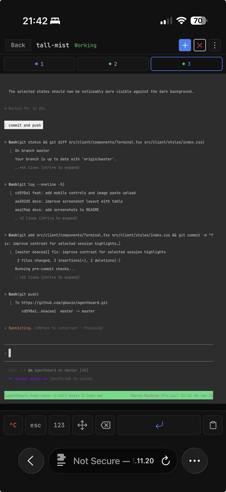

# Agentboard

Web UI for tmux, optimized for agent TUI's (`claude`, `codex`, etc).

Made this because I got sick of using tmux kb shortcuts on my phone, and using Blink.

Run your desktop/server, then connect from your phone or laptop over Tailscale/LAN. Shared workspace across devices.

| Desktop | Mobile |
| :---: | :---: |
|  | <br/><br/> |

## Requirements

- Bun 1.3+
- tmux
- A network path to your machine (Tailscale, LAN, etc.)

## Usage

```bash
bun install
bun run dev
```

Open `http://<your-machine>:5173`. Backend runs on 4040.

Production:
```bash
bun run build
bun run start
```

## Keyboard Shortcuts

- `Cmd+Shift+A` - New session
- `Cmd+Shift+X` - Kill session
- `Cmd+1-9` - Switch sessions

## Environment

```
PORT=4040
TMUX_SESSION=agentboard
REFRESH_INTERVAL_MS=5000
DISCOVER_PREFIXES=work,external
```

`DISCOVER_PREFIXES` lets you see windows from other tmux sessions (view-only).

## Notes

Desktop and iOS Safari optimized.
